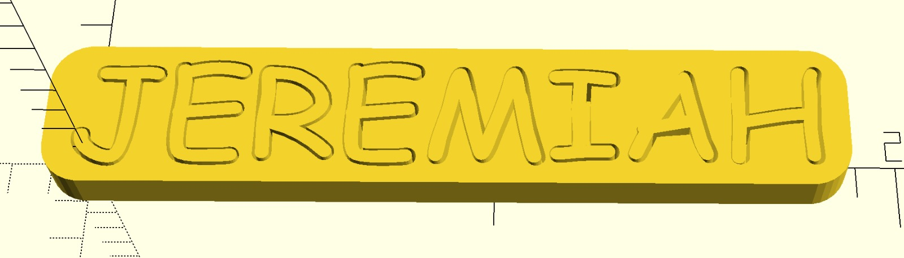
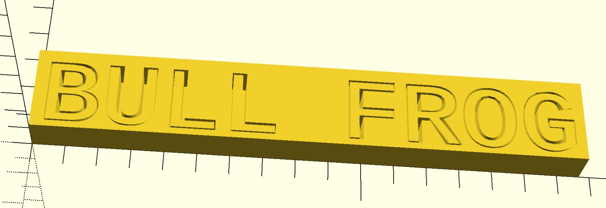

# name-puzzle

[openSCAD](https://www.openscad.org/) script to generate 3D printable name puzzles.

Best if used with a symmetrical font whose bold characters are the same shape as its normal characters (looking at you, comic sans).

You'll need to download Instruction to use that font (see below).

See gen.scad

## See also

[Instruction](https://www.dafont.com/instruction.font) font (symmetrical fonts work great)
measureText from https://www.thingiverse.com/thing:3004457
